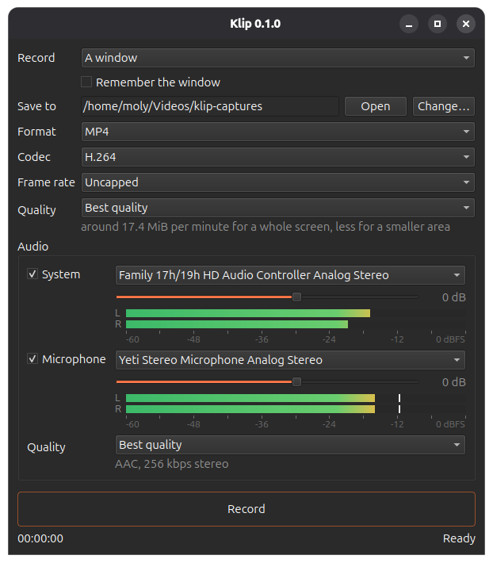

# klip

Klip records your screen, a single window, or a rectangle of either, to a video file. It is a small tool
with a small window: pick a source, pick where the file goes, press record.

Linux first. Windows once Linux is proven.



## Before you record

**Settle the window's size first.** A window is recorded at the size it had when the recording started,
and the video keeps that size to the end. Resizing the window while recording does not change the file:

- **Larger** and the added area is not recorded. The video goes on showing the region the window filled at
  the start, so anything that grows past that edge is lost.
- **Smaller** and the window sits in the corner of the frame with black around it.

That is deliberate. The alternative is to scale every later frame back into the original size, and
rescaling is what turns crisp text into mush -- the thing a screen recording can least afford. Keeping
your pixels one to one costs the area outside the frame and nothing else.

**A scaled display records at its logical size, not the panel's.** If the display is scaled above 100%,
the recording comes out at the size the desktop works in rather than the number of pixels the panel has.
Measured here: a 3840x2160 panel at 133% records at 2880x1620. The desktop portal offers nothing larger,
so no setting in Klip changes it -- record at 100% scale if you need the panel's own pixels.

## Formats

Klip records H.264, HEVC or AV1, into MP4, Matroska or WebM. The window lists only what your graphics card
can actually encode: Klip opens each encoder once at startup and drops the ones the card refuses, so a card
without AV1 encoding never offers it.

| Container | Carries | Reach for it when |
|---|---|---|
| MP4 | H.264, HEVC, AV1 | You want it to play anywhere. The default. |
| Matroska (MKV) | H.264, HEVC, AV1 | You care about surviving a crash -- an MP4 cut off before Klip finishes it may not play at all, where an MKV usually still will. |
| WebM | AV1 | It is going on the web. No sound -- see below. |

H.264 plays on everything. HEVC and AV1 give you a smaller file for the same picture -- measured on this
hardware, HEVC comes out roughly 20% under H.264 and AV1 roughly 30% -- in exchange for needing a newer
player.

**Frame rate** is a ceiling, not a rate. *Up to 30 fps* asks the compositor to send no more than thirty
frames a second, which roughly halves the file on content that is genuinely moving -- measured here, 661 KiB
against 1202 KiB for the same eight seconds. It cannot work the other way: the desktop only sends a frame
where something changed, so a quiet screen comes in far below whatever ceiling you set, and *Uncapped*
simply leaves the compositor to send at the display's refresh rate.

## Sound

Klip records the sound your machine plays, a microphone, or both mixed into one track. Tick a source and
its meter goes live straight away, so you can see a device working before you commit to a recording --
green below -18 dBFS, amber, then red approaching clipping, with a peak marker that holds for a moment.

Both boxes start unticked: a recording is silent unless you ask for sound.

Picking a **System** device records what applications send to it, at the level they send it. That is taken
ahead of the volume control, so muting your speakers to keep a room quiet does not silence the recording,
and turning them up does not make it clip. A **Microphone** is a separate choice and has to be named --
Klip never falls back to "whatever the default input is", because on some setups that is the speakers.

Sound is AAC, and the quality steps map to 64 through 256 kbps. **WebM cannot carry it**: it takes only
Opus or Vorbis, and the FFmpeg Klip is built against flags both encoders experimental, so the audio
controls switch off when you choose WebM. MP4 and Matroska both carry sound.

**Quality** is five steps from *Smallest file* to *Best quality*, and the line underneath estimates what a
minute of recording costs at your screen size. It says "up to" deliberately: it assumes frames arrive as
fast as the compositor will ever send them. A screen that mostly sits still sends far fewer, so a recording
of a quiet desktop can come in at half that or less.

## Requirements

- C++23 compiler — GCC 13+ or Clang 18+. GCC 16 and Clang 22 are the toolchains Klip is developed on;
  the floor is built and checked at GCC 13 and Clang 18 rather than merely declared.
- CMake 3.28+
- Ninja — every preset names it as the generator
- A desktop running `xdg-desktop-portal` with a ScreenCast backend, and PipeWire 1.0+
- A VAAPI driver that can encode, such as `mesa-va-drivers`. Klip opens each encoder once at startup
  and offers only what the card accepts, so a machine without a working driver offers nothing at all.

On Wayland every capture goes through the desktop portal, so Klip asks the compositor for a stream and the
compositor shows you its own picker the first time. That also applies to X11 sessions — there is no separate
X11 path and none is needed.

## Dependencies

- **tge-core** — logging, memory, threading, IO. A git submodule; nothing to install.
- **Qt 6.4+** — Widgets, DBus, Network. Used under LGPLv3 and linked dynamically.
- **FFmpeg 6.1+** (avcodec, avfilter, avformat, avutil, swscale) and **libva** — encoding
- **PipeWire 1.0+** and **libdrm** — the capture stream

Ubuntu 24.04 and newer carry all of them:

```bash
sudo apt install build-essential cmake ninja-build pkg-config qt6-base-dev \
    libavcodec-dev libavfilter-dev libavformat-dev libavutil-dev libswscale-dev \
    libva-dev libdrm-dev libpipewire-0.3-dev
```

On other distributions, configure and read the error: each dependency that is missing names its own
package for Debian, Fedora and Arch before it stops.

## Building

```bash
git clone --recurse-submodules <url> klip
cd klip
make
sudo make install
```

`make` builds Release and prints where the binary landed; `make install` puts it on the prefix along
with a desktop entry and an icon, so Klip appears in the applications menu. `PREFIX` chooses somewhere
else (`make install PREFIX=~/.local`), and `make run` starts it straight from the build tree without
installing anything.

`sudo make uninstall` takes those three files back off again. It goes by the list CMake wrote the last
time you installed, so the prefix does not have to be named a second time, and the directories they sat
in are left alone because they belong to the system rather than to Klip. Underneath it is
`cmake --build <build dir> --target uninstall`, which is the way in from a preset build.

If you cloned without `--recurse-submodules`, `git submodule update --init --recursive` puts that right.

**Reporting a bug? Build `make BUILD_TYPE=RelWithDebInfo` instead.** Release compiles logging out and
carries no symbols, so a crash there gives an address and nothing to read beside it. RelWithDebInfo is
optimised and keeps both, and writes a log to `logs/` next to wherever you started it. Send that, and
the output of `klip --version`.

### Working on Klip

The Makefile is a convenience over CMake; the presets are the real interface.

```bash
cmake --preset linux-gcc-debug
cmake --build --preset linux-gcc-debug
```

Presets: `linux-{gcc,clang}-{debug,release,relwithdebinfo}`. They use whatever `gcc`/`clang` is on
`PATH`; the pinned toolchains live in `CMakeUserPresets.json`, which is machine-specific and not in the
repo.

If your distribution's compiler is older than GCC 13, install a newer one and hand it to the preset,
which keeps the generator and the build type that configuring by hand would drop:

```bash
cmake --preset linux-gcc-debug -DCMAKE_CXX_COMPILER=g++-14 -DCMAKE_C_COMPILER=gcc-14
```

## Checking a recording

`scripts/smoke_test.py` records the screen for a few seconds with nothing clicked, then gates the file it
produced with `ffprobe`: codec, dimensions, duration and packet count, each against what Klip's own log
says it wrote. A zero-frame MP4 is a valid MP4, so a run that did not crash proves nothing on its own.

```bash
python3 scripts/smoke_test.py --seconds 5
```

It films the whole desktop, needs a screen cast grant the first time it runs, and needs `python3-gi` with
the Atspi typelib. The recording lands in a temporary directory and is deleted unless a gate fails.

## Layout

```
src/app/          the executable and its UI
src/capture/      the portal session and the PipeWire streams
src/encode/       the VAAPI encoder and the muxer
cmake/            toolchains, per-compiler flags, platform defines
external/tge-core the foundation library (submodule)
scripts/          the FFmpeg build helper, the smoke test, the sanitizer triage tools
docs/             the screenshot, what measurement taught, and how the checks are run
```

[docs/traps.md](docs/traps.md) is the one to read before changing anything under `src/capture` or
`src/encode`: screen capture on Linux has a number of behaviours that cost real measurement to find, and
several entries exist to stop a plausible-looking change being made twice.
[docs/testing.md](docs/testing.md) covers the smoke test, the sanitizers, valgrind and clang-tidy,
including what each one cannot see.

## License

MIT — see `LICENSE`.
